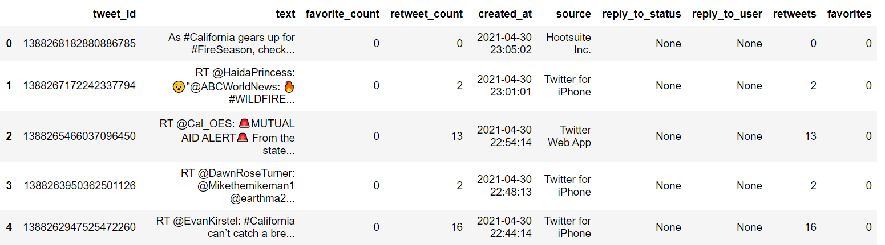

# Data Collection Projects

Before building fancy machine learning models or performing data analysis processes, data collection is always the foundation of any data science project. In this repository, I put my data collection projects here which built with either web scraping or API tools. Most common tools I used: **BeautifulSoup, Selenium, Python, API**. And the data sources I worked on are: **LinkedIn** job post and **Twitter**


Table of Contents:

<!-- START doctoc generated TOC please keep comment here to allow auto update -->
<!-- DON'T EDIT THIS SECTION, INSTEAD RE-RUN doctoc TO UPDATE -->


- [LinkedIn Job Post Scraping](#linkedin-job-post-scraping)
- [Twitter Scraping](#twitter-scraping)
  - [Approach 1: Official Twitter API Wrapper (Reliable, but has query limitation)](#approach-1-official-twitter-api-wrapper-reliable-but-has-query-limitation)
    - [Tweepy](#tweepy)
  - [Approach 2: Browser scripting tool (Unreliable, but no/few query limitation)](#approach-2-browser-scripting-tool-unreliable-but-nofew-query-limitation)
    - [Scweet](#scweet)
    - [twitterscraper  (Not Available anymore)](#twitterscraper--not-available-anymore)

<!-- END doctoc generated TOC please keep comment here to allow auto update -->


## LinkedIn Job Post Scraping 

**Tools Used:** BeautifulSoup, Selenium, chromedriver, Python (pandas)

**Repository**: https://github.com/georgehua/data-collection-projects/tree/main/LinkedIn-scraping

**Notebook URL**: https://georgehua.github.io/data-collection-projects/Linkedin.html

**Availability Check:** 2021-05-24

**About the Project:**

When I was looking for jobs on the LinkedIn job board, I found the built-in sorting system didn't provide enough functionalities to help me choose the most suitable jobs. And I was thinking to extract job descriptions from the LinkedIn platform and built my personal job board. The first thing I need to start is collecting data from LinkedIn.

So, I went to the LinkedIn API documentation, but didn't find any luck from there, since the provided API endpoints are very limited. So, I decided to scrape the data with BeautifulSoup and Selenium. This project is the demonstration of setting up an extraction pipeline for searching `data analyst` position in `Greater Toronto Area, Canada` (It can also be used in other searching conditions by twisting the parameters). I fetched the data using a headless browser to simulate human browsing behavior, then formatted and saved the data into a pandas data frame, eventually exporting it to a CSV file.

Note: Web scraping heavily relies on the interface (HTML and CSS) of the website. So, when LinkedIn updates their frontend interface, the existing pipeline may break. I'll try to update this repository when changes are made by LinkedIn.


After running the pipeline, we will get the following information about the job posting:

- Date
- Title
- Company Name
- Location
- Job Description
- Job Level
- Job Type
- Function
- Industry
- Job ID


**Example Saved Results:**

| Job ID     | Date       | Company Name | Post                  | Location                     | Description                                                  | Level               | Type                     | Function                           | Industry                                                     |
| ---------- | ---------- | ------------ | --------------------- | ---------------------------- | ------------------------------------------------------------ | ------------------- | ------------------------ | ---------------------------------- | ------------------------------------------------------------ |
| 2553709029 | 2021-05-17 | Tucows       | Data Analyst - Remote | Toronto, Ontario, Canada     | Tucows (NASDAQ:TCX, TSX:TC) is on a mission to make the Internet better by providing people everywhere with online access to be empowered to make individual contributions... | Entry level         | Full-time                | Information Technology             | Information Technology and Services, Computer Software, and Internet |
| 2552463476 | 2021-05-24 | VetSuccess   | Business Analyst      | Toronto, Ontario, Canada     | The Role Working closely with project stakeholders, the Business Analyst will define the business requirements and functional specifications... | Entry level         | Full-time                | Information Technology and Analyst | Veterinary and Information Technology and Services           |
| 2542029589 | 2021-05-10 | ContentFly   | Data Analyst          | Toronto, Ontario, Canada     | ContentFly (YC W21) is one of the fastest growing B2B startups in the world. Building the Mailchimp for Content Marketing, we've grown to nearly $4m ARR in a year with a small team, no sales or dedicated marketing. We just closed a $10m Series A with Tier 1 funds like Khosla Ventures & YCombinator... | Mid-Senior level    | Full-time                | Analyst                            | Marketing and Advertising, Computer Software, and Internet   |
| 2547021172 | 2021-05-20 | Yelp         | Data Analyst          | Mississauga, Ontario, Canada | Must-Have • Analytical and problem-solving skills • Interpreting data, analyzing results using statistical techniques • Statistical methods to analyze data and generate useful business reports • Good communication skills • Positive attitude... | Good-to-Have Skills | • Data Mining experience | • Data Mining experience           | Information Technology and Services                          |


## Twitter Scraping

**Tools Used:** BeautifulSoup, Selenium, chromedriver, Python (pandas)

**Repository**: https://github.com/georgehua/data-collection-projects/tree/main/Twitter-scraping

**Demo Notebook URL:** 

- Tweepy: https://georgehua.github.io/data-collection-projects/Tweepy.html
- Scweet: https://georgehua.github.io/data-collection-projects/Scweepy_example.html

**Availability Check:** 2021-04-30

**About the Project:** Each day Twitter generates a massive amount of data, and there's a lot of opportunities to analyze those tweets for different researches. But before doing all sorts of studies, the first step is always to collect data from Twitter. This repository evaluates different libraries or approaches to fetch data from Twitter. I also built demo programs to set up the pipeline from requesting data to parsing and save to ready-to-use CSV file.


### Approach 1: Official Twitter API Wrapper (Reliable, but has query limitation)

#### Tweepy 

Official Website: https://www.tweepy.org/

Tweepy is a Python library for accessing the Twitter API. It is great for simple automation and creating twitter bots. Tweepy has many features. Some main functionality it covers:

- Get tweets from our timeline.
- Creating and deleting Tweets.
- Follow and unfollow users.
- **Query tweets**

The maximum number of requests that are allowed is based on a time interval, some specified period or window of time. The most common request limit interval is 15 minutes. If an endpoint has a rate limit of 900 requests/15-minutes, then up to 900 requests over any 15-minute interval is allowed.


**Example Results:**




### Approach 2: Browser scripting tool (Unreliable, but no/few query limitation)


#### Scweet

Official Repository: https://github.com/Altimis/Scweet

Scweet scrap tweets between two given dates (start_date and max_date), for a given language and list of words or account name, and saves a csv file containing scraped data :

```
[UserScreenName, UserName, Timestamp, Text, Embedded_text, Emojis, Comments, Likes, Retweets, Image link, Tweet URL]
```

Scweet uses headless browser (selenium) to scrape data. Authentication is required in the case of followers/following scraping. It is recommended to log in with a new account (if the list of followers is very long, it is possible that your account will be banned).


**Example Results:**

| UserScreenName |     UserName |                Timestamp |                                              Text | Embedded_text | Emojis | Comments | Likes | Retweets |                                        Image link |                                       Tweet URL |
| -------------: | -----------: | -----------------------: | ------------------------------------------------: | ------------: | -----: | -------: | ----: | -------: | ------------------------------------------------: | ----------------------------------------------: |
|   sukhbir kaur | @sukhbxrkaur | 2020-04-01T04:19:03.000Z | Sunnybrook Hospital.\n#COVID19 #Coronavirusont... |               |        |        4 |    39 |       18 | [https://pbs.twimg.com/media/EUfacJbWAAIVi9A?f... | https://twitter.com/sukhbxrkaur/status/1245204. |


#### twitterscraper  (Not Available anymore)

Official Repository: https://github.com/taspinar/twitterscraper

A simple script to scrape Tweets using the Python package `requests`†to retrieve the content and `Beautifulsoup4` †to parse the retrieved content.

Twitter banned the tool at late 2020.